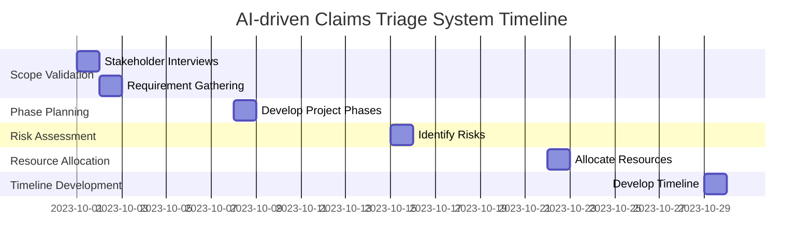

# AI-driven Claims Triage System

## Project Charter
### Executive Summary
The AI-driven Claims Triage System aims to enhance the efficiency of claims processing through an automated triage system. This innovation will streamline operations, reduce human error, and leverage AI technology to improve outcomes.

### Objectives
- Automate the claims triage process to improve efficiency.
- Reduce processing time for claims.
- Minimize human error in claims handling.

### Scope
The project includes:
- Stakeholder interviews for requirement gathering.
- Development of an agile project plan.
- Risk assessment and resource allocation.

### Timeline
- **Week 1:** Complete scope validation
- **Week 2:** Finalize project phases
- **Week 3:** Conduct risk assessment
- **Week 4:** Allocate resources and develop timeline

### Resources
- Skilled project team members.
- Budget allocation of $550,000.

### Risks
1. Technology adoption resistance by staff.
2. Unexpected technical challenges.
3. Budget overruns.

### Governance
Regular stakeholder meetings and project team check-ins to ensure alignment and accountability.

## Gantt Chart


## Resource Allocation Plan
| Role               | Responsibilities                           |
|--------------------|-------------------------------------------|
| Project Manager     | Overall project coordination              |
| Business Analyst    | Requirement gathering and stakeholder management |
| Technical Lead      | Oversee development of AI solutions       |
| QA Specialist       | Ensure quality of the triage system       |

## Prioritization Analysis
| Task                   | Score |
|------------------------|-------|
| Scope Validation       | 30    |
| Phase Planning         | 25    |
| Risk Assessment        | 35    |
| Resource Optimization   | 20    |
| Timeline Development    | 17.5  |

## Risk Assessment and Mitigation Plan
| Risk                                            | Mitigation Strategy                                         |
|-------------------------------------------------|------------------------------------------------------------|
| Technology adoption resistance                   | Involve staff in the development process to gain buy-in    |
| Unexpected technical challenges                  | Set aside a contingency budget for unforeseen expenses      |
| Budget overruns                                  | Regularly track expenditures and adjust project scope as necessary |

## Detailed Project Plan
1. **Scope Validation:**
   - Activities: Stakeholder interviews, requirement gathering, and analysis
   - Estimated Work Effort: 4 hours (0.5 days)

2. **Phase Planning:**
   - Activities: Develop detailed project phases and milestones using agile methodology
   - Estimated Work Effort: 8 hours (1 day)

3. **Risk Assessment:**
   - Activities: Identify potential risks, conduct impact analysis, and develop mitigation plans
   - Estimated Work Effort: 8 hours (1 day)

4. **Resource Optimization:**
   - Activities: Allocate resources based on skill sets, project phases, and team availability
   - Estimated Work Effort: 8 hours (1 day)

5. **Timeline Development:**
   - Activities: Create a detailed project timeline with milestones, deliverables, and deadlines
   - Estimated Work Effort: 8 hours (1 day)

**Total Estimated Work Effort: 36 hours (4.5 days)**

## Financial Summary
| Item                    | Budget Allocated | Current Expenditure | Remaining Budget |
|-------------------------|------------------|---------------------|------------------|
| Total Budget            | $550,000         | $0                  | $550,000         |

## Stakeholder Communication Plan
| Stakeholder            | Communication Method | Frequency                |
|-----------------------|---------------------|--------------------------|
| Project Team          | Weekly Meetings      | Every Monday             |
| Executive Sponsors     | Monthly Updates      | First Monday of each month|
| Key Stakeholders       | Bi-weekly Reports    | Every two weeks on Fridays|
```
```