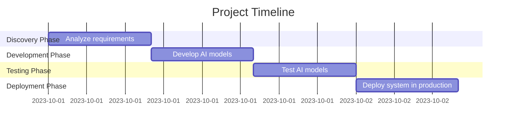

# Project Charter: AI-driven Claims Triage System

## Executive Summary
A project to develop an AI system to optimize claims triage.

## Project Objectives
- Improve claim processing speed
- Increase accuracy of claim validation

## Project Scope
### Includes:
- Development, testing, and deployment of the AI system.

### Excludes:
- Any post-deployment support or maintenance.

## Timeline
- **Start Date**: TBD
- **End Date**: TBD
- **Duration**: 32 hours over multiple phases

## Budget
- **Total Budget**: $550,000

## Project Team
- **Sponsor**: TBD
- **Manager**: TBD

## Assumptions
- Timely access to required data and resources.

## Constraints
- Must adhere to the budget and timeline.

## Stakeholders
- TBD

## Gantt Chart

## Resource Allocation Plan
| Role               | Number of Roles |
|--------------------|------------------|
| Data Scientist      | 2                |
| QA Engineer         | 2                |
| DevOps Engineer     | 1                |

## Prioritization Analysis
| Item                     | Score |
|--------------------------|-------|
| Model Development        | 90    |
| Testing                  | 80    |
| Deployment               | 85    |
| Discovery                | 70    |

## Risk Assessment and Mitigation Plan
| Risk ID | Description                | Likelihood | Impact | Mitigation Strategy                     |
|---------|----------------------------|------------|--------|----------------------------------------|
| 1       | Integration challenges      | Medium     | High   | Plan integration stages carefully      |
| 2       | Model performance issues    | High       | High   | Implement fallback strategies          |

## Financial Summary
| Category    | Planned  | Actual  | Variance |
|-------------|----------|---------|----------|
| Development | $300,000 | $0      | $300,000 |
| Testing     | $100,000 | $0      | $100,000 |
| Deployment  | $150,000 | $0      | $150,000 |
| **Total**   | **$550,000** | **$0**  | **$550,000** |