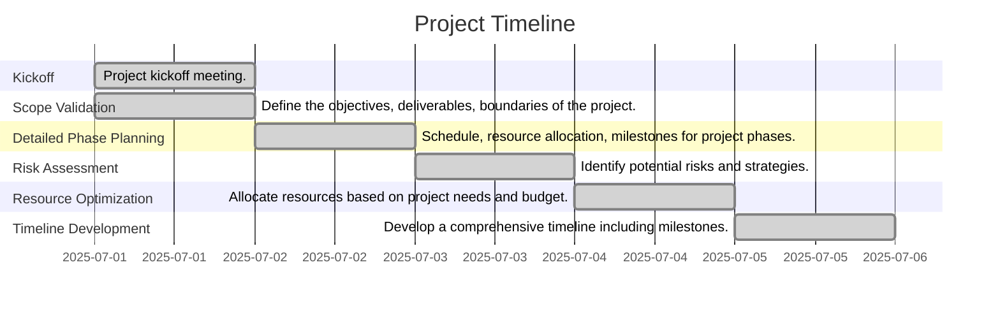

# Comprehensive Project Plan for AI-driven Claims Triage System

## Project Charter

### Executive Summary
Business need to be defined.

### Project Objectives
- Define the objectives, deliverables, and boundaries of the project.

### Project Scope
- **Includes**: Deliverables for validation, detailed plans, risk assessments, resource optimization, and timeline development.
- **Excludes**: Anything beyond the initial phases outlined above.

### Timeline
- **Start Date**: TBD
- **End Date**: TBD
- **Duration**: TBD

### Budget
- **Total Budget**: $550,000
- **Planned Costs**: TBD

### Project Team
- **Sponsor**: TBD
- **Manager**: TBD

### Assumptions
- TBD

### Constraints
- TBD

### Stakeholders
- TBD

## Gantt Chart

## Resource Allocation Plan

| Role | Name |
|------|------|
| Project Manager | Alice |
| AI Specialist | Bob |
| Data Analyst | Charlie |
| QA Engineer | Dana |
| Business Analyst | Eve |

## Prioritization Analysis

| Task                  | Score |
|-----------------------|-------|
| Scope Validation      | 5     |
| Detailed Phase Planning| 4    |
| Risk Assessment        | 3    |
| Resource Optimization  | 2     |
| Timeline Development   | 1     |

## Risk Assessment and Mitigation Plan

| Risk                     | Likelihood | Impact | Mitigation Strategy |
|--------------------------|------------|--------|---------------------|
| Technical Challenges      | Medium     | High   | Technical advisory team. |
| Resource Availability      | High       | Medium | Cross-training team members. |

## Financial Summary

| Category        | Amount   |
|-----------------|----------|
| Initial Budget  | $550,000 |
| Expected Costs  | $300,000 |
| Remaining Budget | $250,000 |