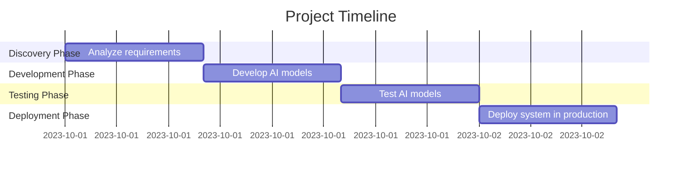

# Project Timeline: AI-driven Claims Triage System

## Gantt Chart

## Timeline Summary
This Gantt chart shows the project timeline with key milestones and deliverables.

---
*Generated on: 2025-06-29 18:46:03*
