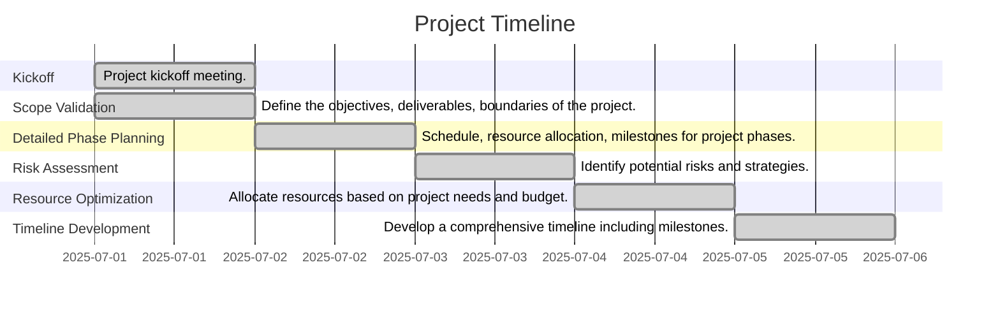

# Project Timeline: Project Plan

## Gantt Chart

```mermaid
gantt
    title Project Timeline
    dateFormat  YYYY-MM-DD
    section Kickoff
    Project kickoff meeting. :done, des0, 2025-07-01, 1d
    section Scope Validation
    Define the objectives, deliverables, boundaries of the project. :done, des1, 2025-07-01, 1d
    section Detailed Phase Planning
    Schedule, resource allocation, milestones for project phases. :done, des2, 2025-07-02, 1d
    section Risk Assessment
    Identify potential risks and strategies. :done, des3, 2025-07-03, 1d
    section Resource Optimization
    Allocate resources based on project needs and budget. :done, des4, 2025-07-04, 1d
    section Timeline Development
    Develop a comprehensive timeline including milestones. :done, des5, 2025-07-05, 1d
```

## Timeline Summary
This Gantt chart shows the project timeline with key milestones and deliverables.

---
*Generated on: 2025-06-29 18:47:28*
