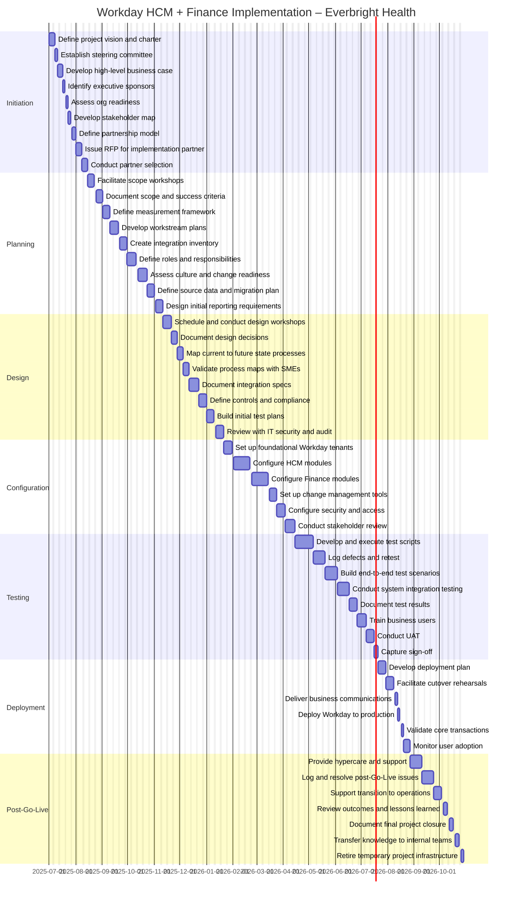

```mermaid
gantt
    title Workday HCM + Finance Implementation – Everbright Health
    dateFormat  YYYY-MM-DD
    excludes    weekends

    section Initiation
    Define project vision and charter         :a1, 2025-07-01, 5d
    Establish steering committee             :a2, after a1, 3d
    Develop high-level business case         :a3, after a2, 4d
    Identify executive sponsors              :a4, after a3, 2d
    Assess org readiness                     :a5, after a4, 2d
    Develop stakeholder map                  :a6, after a5, 3d
    Define partnership model                 :a7, after a6, 4d
    Issue RFP for implementation partner     :a8, after a7, 5d
    Conduct partner selection                :a9, after a8, 5d

    section Planning
    Facilitate scope workshops               :b1, after a9, 6d
    Document scope and success criteria      :b2, after b1, 6d
    Define measurement framework             :b3, after b2, 6d
    Develop workstream plans                 :b4, after b3, 8d
    Create integration inventory             :b5, after b4, 6d
    Define roles and responsibilities        :b6, after b5, 9d
    Assess culture and change readiness      :b7, after b6, 9d
    Define source data and migration plan    :b8, after b7, 6d
    Design initial reporting requirements    :b9, after b8, 6d

    section Design
    Schedule and conduct design workshops    :c1, after b9, 8d
    Document design decisions                :c2, after c1, 5d
    Map current to future state processes    :c3, after c2, 5d
    Validate process maps with SMEs          :c4, after c3, 5d
    Document integration specs               :c5, after c4, 7d
    Define controls and compliance           :c6, after c5, 7d
    Build initial test plans                 :c7, after c6, 7d
    Review with IT security and audit        :c8, after c7, 7d

    section Configuration
    Set up foundational Workday tenants      :d1, after c8, 8d
    Configure HCM modules                    :d2, after d1, 15d
    Configure Finance modules                :d3, after d2, 15d
    Set up change management tools           :d4, after d3, 6d
    Configure security and access            :d5, after d4, 8d
    Conduct stakeholder review               :d6, after d5, 8d

    section Testing
    Develop and execute test scripts         :e1, after d6, 15d
    Log defects and retest                   :e2, after e1, 10d
    Build end-to-end test scenarios          :e3, after e2, 10d
    Conduct system integration testing       :e4, after e3, 10d
    Document test results                    :e5, after e4, 7d
    Train business users                     :e6, after e5, 7d
    Conduct UAT                              :e7, after e6, 7d
    Capture sign-off                         :e8, after e7, 3d

    section Deployment
    Develop deployment plan                  :f1, after e8, 7d
    Facilitate cutover rehearsals            :f2, after f1, 7d
    Deliver business communications          :f3, after f2, 3d
    Deploy Workday to production             :f4, after f3, 2d
    Validate core transactions               :f5, after f4, 3d
    Monitor user adoption                    :f6, after f5, 5d

    section Post-Go-Live
    Provide hypercare and support            :g1, after f6, 10d
    Log and resolve post-Go-Live issues      :g2, after g1, 10d
    Support transition to operations         :g3, after g2, 7d
    Review outcomes and lessons learned      :g4, after g3, 5d
    Document final project closure           :g5, after g4, 5d
    Transfer knowledge to internal teams     :g6, after g5, 5d
    Retire temporary project infrastructure  :g7, after g6, 3d
``` 